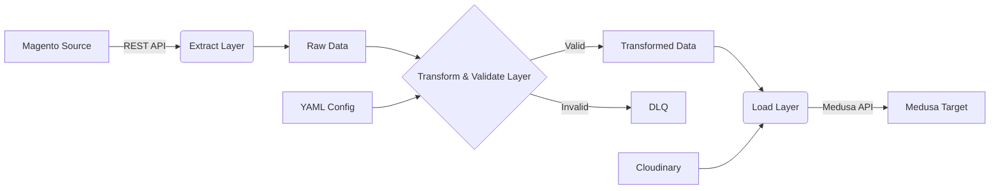

# Magento to Medusa Migration & Sync Tool


A production-grade, modular data migration pipeline designed to synchronize e-commerce data from Magento 2 (Enterprise) to Medusa (Headless Commerce). This tool handles complex EAV model transformation, data validation, and idempotent synchronization for core entities like Products, Categories, Customers, and Orders.

> **Project Genesis:** This tool was developed as part of a structured 12-week capstone project, evolving from foundational platform setup to a fully-featured, demo-ready migration pipeline.

## 📋 Table of Contents

- [✨ Core Features](#-core-features)
- [🏗️ Architecture & Design Philosophy](#️-architecture--design-philosophy)
- [📁 Project Structure](#-project-structure)
- [⚙️ Installation & Quick Start](#️-installation--quick-start)
- [🚀 Usage: CLI & Migration Pipeline](#-usage-cli--migration-pipeline)
- [🔧 Configuration: Mapping & Transformation](#-configuration-mapping--transformation)
- [📊 Data Model & Supported Entities](#-data-model--supported-entities)
- [🔍 Validation, Logging & DLQ](#-validation-logging--dlq)
- [🧪 Testing](#-testing)
- [🐳 Docker Deployment (Capstone Week 12)](#-docker-deployment-capstone-week-12)
- [📈 Project Roadmap (12-Week Plan)](#-project-roadmap-12-week-plan)
- [🤝 Contributing](#-contributing)
- [📄 License](#-license)

## ✨ Core Features

- **Full-Entity Migration:** Seamlessly migrate **Products, Categories, Customers, Orders, and Addresses**.
- **Declarative Schema Mapping:** YAML-based configuration for flexible, maintainable field mapping between Magento's EAV model and Medusa's data structure.
- **Extensible Transformation Pipeline:** Built-in data normalizers for prices, descriptions (HTML cleanup), image URLs, and status codes.
- **Robust Validation Framework:** Pre-flight and post-flight validation with configurable rules. Invalid records are routed to a **Dead Letter Queue (DLQ)** for analysis and reprocessing.
- **Production Resilience:** Implements **retry mechanisms with exponential backoff**, rate limiting, pagination handling, and checkpointing for long-running jobs.
- **Cloud-Native Media Handling:** **Automatic upload of product images** from Magento URLs to Cloudinary (or any S3-compatible service), optimizing and linking them in Medusa.
- **Delta Synchronization:** Smart sync based on `updated_at` timestamps to process only changed data.
- **Comprehensive Observability:** Structured logging, performance metrics, and detailed audit trails for every operation.

## 🏗️ Architecture & Design Philosophy

The tool follows a **modular, pipeline-based architecture**, inspired by ETL (Extract, Transform, Load) principles. Each component is loosely coupled, promoting testability and ease of extension.


## Key Design Decisions

### 1. Idempotency
All operations are designed to be **idempotent** and can be safely re-run multiple times without creating duplicated data.  
The system relies on **external unique identifiers** such as:
- SKU (Products)
- Email (Customers)
- Magento Order ID (Orders)

These identifiers act as stable keys to ensure consistent upserts during migration.

---

### 2. Separation of Concerns
The codebase follows a strict separation of responsibilities to improve maintainability and scalability:

- `connectors/`  
  Handle all API communication and authentication logic.

- `transformers/`, `validators/`  
  Contain business rules, data normalization, and validation logic.

- `cli.py`, `sync_manager.py`  
  Orchestrate execution flow, batching, retries, and checkpoints.

This structure allows each layer to evolve independently.

---

### 3. Configuration over Code
Schema mappings and synchronization behaviors are defined using **YAML configuration files**.

Benefits:
- No code changes required for field remapping
- Easy customization per project or client
- Clear visibility of data transformation rules

---

### 4. Graceful Degradation
The migration process is resilient to incomplete data:

- Supports partial migrations (e.g., products without images)
- Continues processing remaining records on non-critical errors
- Emits clear and actionable warnings in logs

This ensures maximum progress even under imperfect source data conditions.

## 📁 Project Structure

```text
connector_magento_medusa_v2/
├── connectors/                 # API Abstraction Layer
│   ├── base_connector.py      # Abstract class with retry & rate-limit handling
│   ├── magento_connector.py   # Magento 2 REST API client
│   └── medusa_connector.py    # Medusa Admin API client
│
├── core/                      # Business Logic Core
│   ├── sync_manager.py        # Main orchestration engine (batching, retry, resume)
│   │
│   ├── transformers/          # Data transformation & normalization
│   │   ├── base_transformer.py
│   │   ├── product_transformer.py
│   │   └── customer_transformer.py
│   │
│   └── validators/            # Data validation & business rules
│       ├── base_validator.py
│       └── product_validator.py
│
├── mapping_configs/           # Declarative Field Mapping (YAML)
│   ├── product_mapping.yaml
│   ├── category_mapping.yaml
│   └── customer_mapping.yaml
│
├── data/                      # Runtime Data & Observability
│   ├── logs/                  # Application & error logs
│   ├── checkpoint/            # Sync progress checkpoints (resume support)
│   └── dlq/                   # Dead Letter Queue (invalid / failed records)
│
├── scripts/                   # Deployment & utility scripts
├── tests/                     # Unit & integration tests
│
├── cli.py                     # Command Line Interface entrypoint
├── docker-compose.yml         # Full-stack demo environment (Week 12)
├── requirements.txt
├── .env.template
└── README.md                  # Project documentation
```


## ⚙️ Installation & Quick Start

### Prerequisites

- **Python 3.8+** and `pip`
- **Magento 2.x** with REST API access (Integration Token)
- **Medusa 1.x+** instance with Admin API enabled
- **Cloudinary account** (recommended for image handling)

---

### 1. Clone & Setup

```bash
git clone https://github.com/CatV2004/connector_magento_medusa_v2.git
cd connector_magento_medusa_v2

python -m venv venv
source venv/bin/activate   # On Windows: venv\Scripts\activate

pip install -r requirements.txt
```

### 2. Configuration

Copy the environment template and update it with your system credentials:

```bash
cp .env.template .env
# Edit .env with your credentials
nano .env
```

.env Configuration
```bash
# ===== SOURCE: MAGENTO =====
MAGENTO_BASE_URL=https://your-magento-store.com/rest/V1
MAGENTO_ACCESS_TOKEN=your_integration_token_here

# ===== TARGET: MEDUSA =====
MEDUSA_BASE_URL=https://your-medusa-admin.com
MEDUSA_API_KEY=your_medusa_api_key_here

# ===== MEDIA HANDLING (Cloudinary) =====
CLOUDINARY_CLOUD_NAME=your_cloud_name
CLOUDINARY_API_KEY=your_api_key
CLOUDINARY_API_SECRET=your_api_secret
ENABLE_IMAGE_UPLOAD=true

# ===== PIPELINE BEHAVIOR =====
BATCH_SIZE=50
MAX_RETRIES=3
LOG_LEVEL=INFO
ENABLE_DELTA_SYNC=true
```

### 3. Validate Connections
```bash
python cli.py validate-connections
```

## 🚀 Usage: CLI & Migration Pipeline

The migration tool is operated via a comprehensive **Command Line Interface (CLI)**, which orchestrates the full data pipeline including extraction, transformation, validation, and loading.

---

### Run a Full Migration (Demo Mode)

This command migrates all supported entities in the correct dependency order:

**Categories → Products → Customers → Orders**

It is recommended to run a dry-run first to validate mappings, transformations, and API connectivity without writing data to the target system.

```bash
python cli.py migrate-all --dry-run   # Simulate migration
python cli.py migrate-all             # Execute full migration
```

### Run Selective Entity Migration

You can migrate individual entities independently, which is useful for incremental runs, debugging, or partial re-migration.

```bash
# Migrate Categories
python cli.py migrate --entity category

# Migrate Products (with image upload enabled)
python cli.py migrate --entity product --upload-images

# Migrate Customers (trigger password reset emails)
python cli.py migrate --entity customer --send-reset-email

# Migrate Orders (delta migration from the last 7 days)
python cli.py migrate --entity order --delta-days 7
```

### Inspect & Manage Data

The CLI also provides operational commands for inspecting source data, managing failures, and validating migration results.

```bash
# List products extracted from Magento (preview mode)
python cli.py extract magento product --limit 5

# List failed records stored in the Dead Letter Queue (DLQ)
python cli.py dlq list --entity product

# Retry failed records from a specific DLQ job
python cli.py dlq retry --job-id 123e4567

# Generate a data consistency & reconciliation report
python cli.py report summary
```

## 🔧 Configuration: Mapping & Transformation

### Customizing Field Mapping

Field mapping is fully **declarative** and defined using YAML files located in `mapping_configs/`.  
This approach allows schema changes and transformation logic to be adjusted **without modifying application code**.

Below is an example product mapping configuration (`product_mapping.yaml`):

```yaml
version: "1.0"
entity: product
description: "Mapping from Magento Catalog to Medusa Product & Variants"
source_system: magento
target_system: medusa

field_maps:
  # Direct field-to-field mapping
  - source_field: sku
    target_field: variants[0].sku
    required: true
    transformer: "strip_whitespace"

  - source_field: name
    target_field: title
    required: true

  # Conditional mapping with transformation
  - source_field: price
    target_field: variants[0].prices[0].amount
    required: false
    default: 0
    transformer: "price_to_cents"   # Converts 19.99 -> 1999

  # Complex mapping (Magento EAV to Medusa flat field)
  - source_field: custom_attributes
    target_field: metadata.material
    source_path: "custom_attributes.material.value"
    transformer: "map_material_type"

# Global transformers applied to the entire entity
global_transformers:
  - "clean_html_description"
  - "normalize_status"   # Maps 'Enabled' -> 'published'
```

## 🔧 Adding a Custom Transformer

1. Create a new function in `core/transformers/product_transformer.py`.
2. Register it in the `get_transformer` method.
3. Reference it by name in your mapping YAML.

---

## 📊 Data Model & Supported Entities

| Entity    | Magento Model        | Medusa Model                  | Key Mapping Logic |
|----------|----------------------|-------------------------------|-------------------|
| Category | `catalog/category`   | `ProductCollection`           | Tree structure flattening, URL key → handle mapping |
| Product  | `catalog/product`    | `Product` + `ProductVariant`  | Configurable products become a Medusa Product with multiple Variants. Simple products become single-variant products |
| Customer | `customer/customer`  | `Customer`                    | Password migration is not supported. Optionally triggers password reset email |
| Address  | Nested under customer| `Address` (associated)        | Billing and shipping address normalization and mapping |
| Order    | `sales/order`        | `Order` + `LineItem`          | Status mapping, totals reconciliation, line items linked via SKU |

## 🔍 Validation, Logging & DLQ

### Validation Rules

Validators are executed **before inserting data into Medusa** to ensure data integrity, business correctness, and system stability.

Example validation rules include:

- **Product**
  - SKU must exist and be non-empty
  - Price must be numeric and non-negative
  - All required fields must be present

- **Customer**
  - Email format must be valid
  - Email must be unique
  - First name must be present

- **Order**
  - Financial consistency check:
    ```
    sum(line_total) + tax + shipping = grand_total
    ```
  - All order items must reference valid SKUs

## ☠️ Dead Letter Queue (DLQ)

Records that **fail validation or API insertion** are stored in the **Dead Letter Queue (DLQ)** for later inspection and reprocessing.

DLQ files are persisted under: ```data/dlq/``` Each failed record is stored as a structured JSON document containing full context about the failure.
### DLQ Record Example

```json
{
  "id": "550e8400-e29b-41d4-a716-446655440000",
  "entity": "product",
  "original_data": { "...": "..." },
  "error": "ValidationError: Price field is negative.",
  "failed_at": "2024-01-15T10:30:00Z",
  "retry_count": 1
}
```
Use the CLI to inspect and retry DLQ items.

### Logging

The system uses **structured logging** to provide clear visibility into migration progress and failures.

Logs are written to:
- Standard output (stdout)
- Log files under:


## 🧪 Testing

Run the test suite to verify core functionality, data transformations, and system integration.

```bash
# Run unit tests
pytest tests/unit/ -v

# Run integration tests (requires .env.test to be configured)
pytest tests/integration/ -v

# Run tests with coverage report
pytest --cov=core --cov=connectors tests/
```

## 🐳 Docker Deployment (Capstone – Week 12)

For the final demo, a complete end-to-end environment can be provisioned using **Docker Compose**, simulating a real-world migration scenario.

This setup includes:
- Magento (with sample data)
- Medusa
- The migration tool container

```bash
# Start Magento (sample data), Medusa, and the migration tool
docker-compose up -d

# Run the full migration inside the migrator container
docker-compose exec migrator python cli.py migrate-all

# View migrator logs in real time
docker-compose logs -f migrator

# Tear down and remove volumes
docker-compose down -v
```

## 📈 Project Roadmap (12-Week Plan)

This project was executed as a structured **learning and development journey**, with each phase delivering production-quality components that are included in this repository.

| Week | Focus Area | Deliverables (Included in this Repo) |
|-----:|------------|--------------------------------------|
| 5 | Platform Foundation | Magento + Medusa Docker setup, API exploration, sample data import |
| 6 | Connector Layer | Robust `magento_connector.py` & `medusa_connector.py` with authentication, pagination, and rate-limit handling |
| 7–8 | Schema Mapping & Products | YAML-based mapping system, `product_transformer.py`, `product_validator.py`, working product & category migration |
| 9 | Customers & Addresses | Customer and address mapping, GDPR-compliant password handling (reset email flow) |
| 10–11 | Orders & Transactions | Complex order migration with consistency checks, inventory sync logic, delta migration capability |
| 12 | Capstone & Demo | Final integration, Docker Compose environment, comprehensive logging, and live demo preparation |

This roadmap reflects a progression from foundational platform understanding to a fully operational, production-style migration system.

## 🤝 Contributing

Contributions are welcome! Please follow these steps:

1. **Fork the repository**

2. **Create a feature branch**
   ```bash
   git checkout -b feature/amazing-feature
```
3. **Commit your changes**
   ```bash
   git commit -m "Add some amazing feature"
```
4. **Push to the branch**
   ```bash
   git push origin feature/amazing-feature
```
5. **Open a Pull Request**
Please ensure your code adheres to the existing style (Black formatter) and includes appropriate tests.

## 📄 License

Distributed under the **MIT License**.  
See the `LICENSE` file for more information.

---

## 🙏 Acknowledgments

- **Magento 2** for providing a comprehensive and flexible REST API
- **Medusa team** for building an excellent open-source headless commerce platform
- The maintainers of **requests**, **pydantic**, **pyyaml**, and other critical Python libraries that made this tool possible

---

🚀 **Ready to migrate?**  
Start with the following command to preview what will be synced:

```bash
python cli.py migrate-all --dry-run


